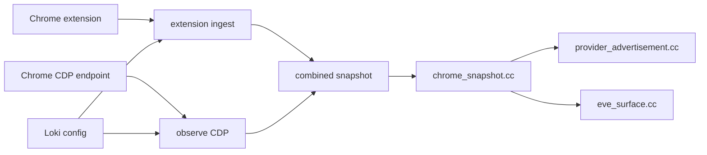

# Loki Architecture

## Objective

Expose local Chrome tab state as provider-owned, typed service state for
CultMesh/Eve consumers while keeping Chrome installation easy for the operator.

## Current Mechanism

The Chrome extension observes tab metadata with explicit Chrome permissions and
posts reports to Loki's localhost ingest endpoint. Chrome can also expose
DevTools metadata on `127.0.0.1:{port}` when started with
`--remote-debugging-port`. Loki normalizes both sources into one snapshot and
writes three documents from that snapshot.

## Invariants

- CDP reachability is observed state, not assumed capability.
- Extension reachability is observed state, not assumed capability.
- Chrome owns page reality; Loki owns only the observation snapshot.
- `.cc` witnesses are the durable local state surface.
- Eve/CultUI output is derived from the same snapshot as the witness.
- No renderer or dashboard can override the daemon's observation state.

## Intended Change Path

1. Add CultCacheTS-backed binary `.cc` persistence behind the current writer.
2. Add CultNet/CultMesh publication of the same documents.
3. Add command handling only through `gamecult.eve.command.v1`.
4. Add consentful CDP actions, starting with read-only page metadata and
   operator-approved screenshot capture.

## Command Boundary

Loki currently advertises no executable tab commands. This is deliberate. A
daemon that can evaluate JavaScript inside live user tabs is holding a sharp
tool; it needs an explicit command document, audit log, origin, target tab id,
and denial path before it should act.
